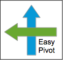

# Introduction

This is the home of "Easy Pivot", which is SQL code you can easily
add on to the end of your query project to dynamically pivot data.

Currently, it only works with Microsoft SQL Server databases.

# Features

With Easy Pivot, you can:

* Dynamically pivot fields, resulting in any number of pivoted columns
* Perform one- or two-field pivots
* Use various pivot aggregate functions (COUNT, SUM, AVG, MIN, MAX, STDEV)
* Automatically remove NULLs that normally result from pivoting
* Customize values for pivoted data, such as Yes/No, True/False, etc.
* Choose any number of fields to pivot on
* Choose any number of fields to group on while pivoting
* Position the pivoted columns between grouping fields
* Reverse the sort order of the pivoted columns

All the work is done for you, except for a small amount of
configuration required to specify a data source and what field(s)
to group and pivot on. The data source is a local temporary table
in which you have collected your pre-pivoted data. You may also
tell Easy Pivot to output the pivot code it builds for your
personal study or use in other SQL work.
