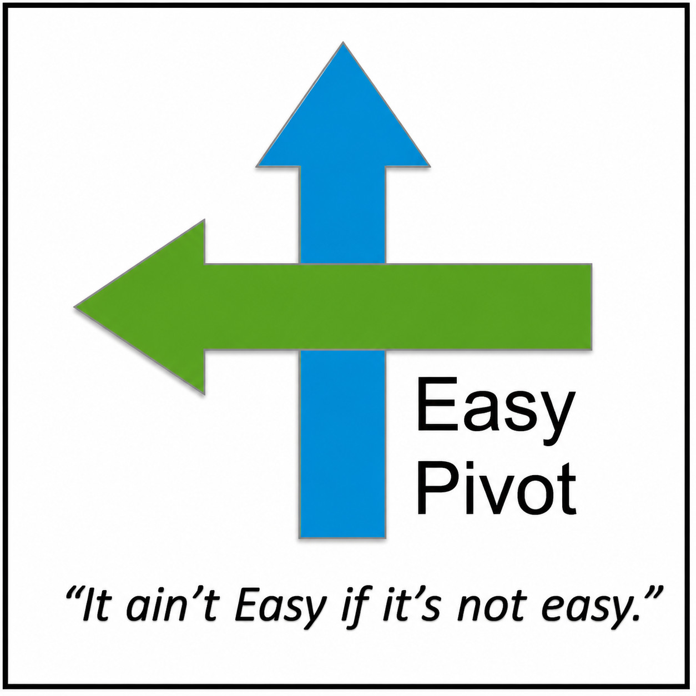

# Introduction
This is the home of "Easy Pivot", code you can easily add to
your database query projects to dynamically pivot data.

Easy Pivot currently supports:

    * Microsoft SQL Server
    * Oracle Database
    * PostgreSQL

Choose the folder corresponding to your target database platform:

    sql_server/
    oracle/
    postgresql/

Each implementation contains:

    * Database-specific Easy Pivot source code
    * Installation instructions
    * Documentation
    * Frequently asked questions
    * Example configurations

# Easy Pivot in 2026
Easy Pivot was originally published on GitHub in 2021.

Recently, numerous edge cases, usability improvements,
and compatibility fixes have been incorporated into the project.

If it has been a while since you last evaluated Easy Pivot,
it may be worth taking another look.

# Future Directions
Easy Pivot currently supports Microsoft SQL Server,
Oracle Database, and PostgreSQL.

Additional database backends including MySQL and SQLite
are under investigation.

The goal is to preserve the same JSON configuration
philosophy, user experience, and "no installation
required" design principles regardless of database
platform.

# Features
With Easy Pivot, you can:

* Dynamically pivot fields, resulting in any number of pivoted columns
* Perform aggregate or Boolean pivots (Yes/No, True/False, Present/Absent,
  or any values you choose)
* Use any aggregate function supported by the target database platform's
  pivot implementation.
* Automatically remove NULLs that normally result from pivoting
* Choose any number of fields to pivot on
* Choose any number of fields to group on while pivoting
* Position the pivoted columns between grouping fields
* Reverse the sort order of left-to-right pivoted column names
* Specify ascending ("ASC") or descending ("DESC") group sorting

All the work is done for you, except for a small amount of
configuration required to specify a data source and what field(s)
to group and pivot on.

The data source requirements depend on the target
database platform.

SQL Server uses a local temporary table populated by
your query.

Oracle and PostgreSQL execute directly against the
user query supplied in the USER AREA.

Regardless of platform, the JSON configuration remains
essentially the same.

You may also tell Easy Pivot to output the pivot code it builds for
your personal study or use in other SQL work. If the complete code
does not appear in the Messages tab of SQL Server's output window,
you can use the Results tab instead. The code there will be in a
single line, but you can use an SQL formatter program or website to
format it into multiple lines. However, it is possible that the SQL
formatter may not format it correctly. In that case, SQL Server
Management Studio should give you a clue where the error is so that
it can be corrected. It will probably have something to do with
spacing inside bracketed alias names for fields.

Note: PostgreSQL users should execute the Easy Pivot generator as a
script (F5 in pgAdmin). The generated pivot query itself may then
be executed as ordinary SQL.

You cannot directly schedule an Easy Pivot job. Easy Pivot uses
dynamic query execution which is not compatible with job scheduling.
You can, however, tell Easy Pivot to generate the pivot query
source code and replace the Easy Pivot code with it for a scheduled
job.

When Easy Pivot is used in source-code generation mode
("DECLARE @generate_source_code_only AS BIT = 1"), the generated
SQL contains a fixed list of pivot values discovered at generation
time. If new pivot values appear later in the source data, those
values will not automatically appear in scheduled job reports using
previously generated static SQL.

To incorporate new pivot values:

 1. Run Easy Pivot again against current source data.
 2. Generate updated source code.
 3. Replace the scheduled query with the newly generated version.

For questions or comments, send email to tds67 (at) protonmail.com
