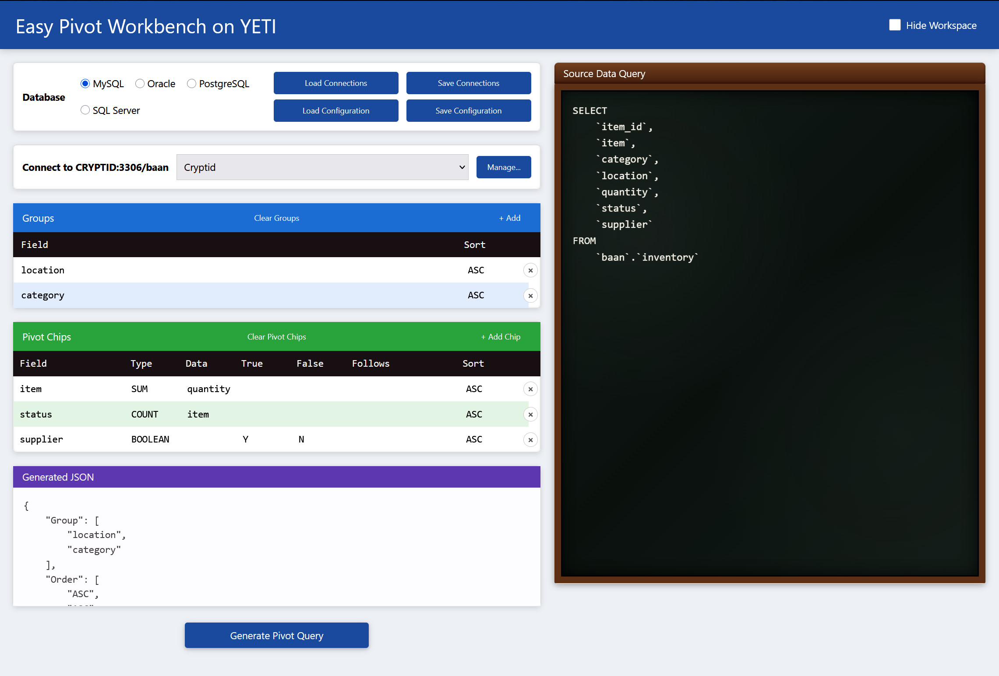
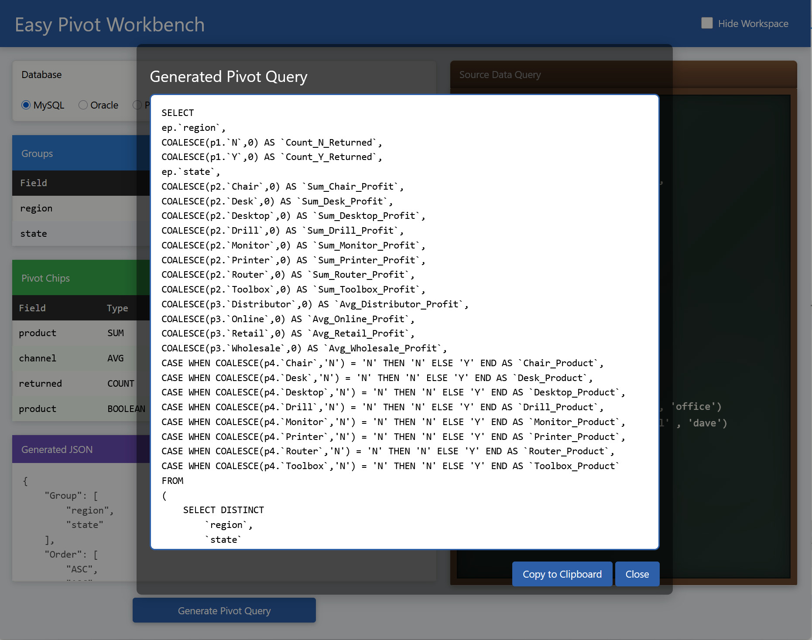
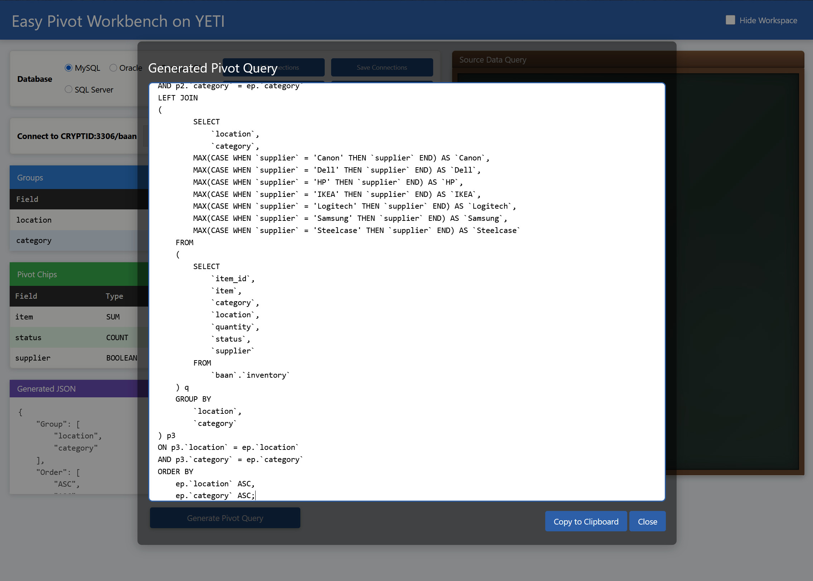
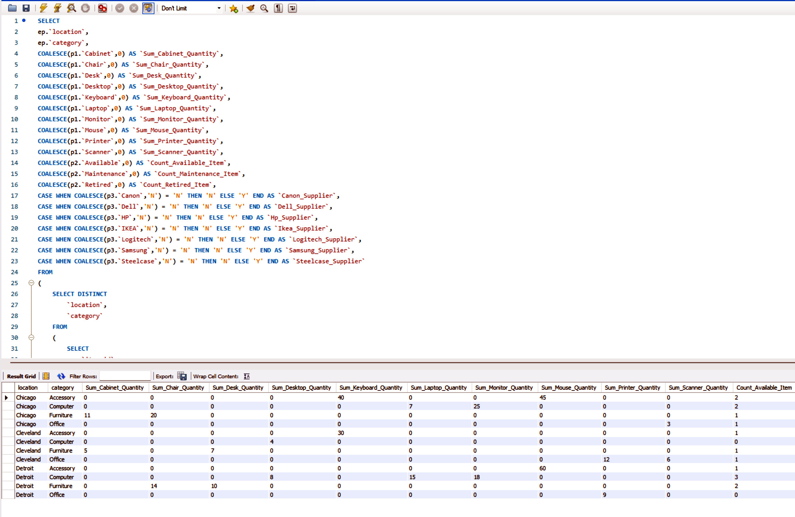
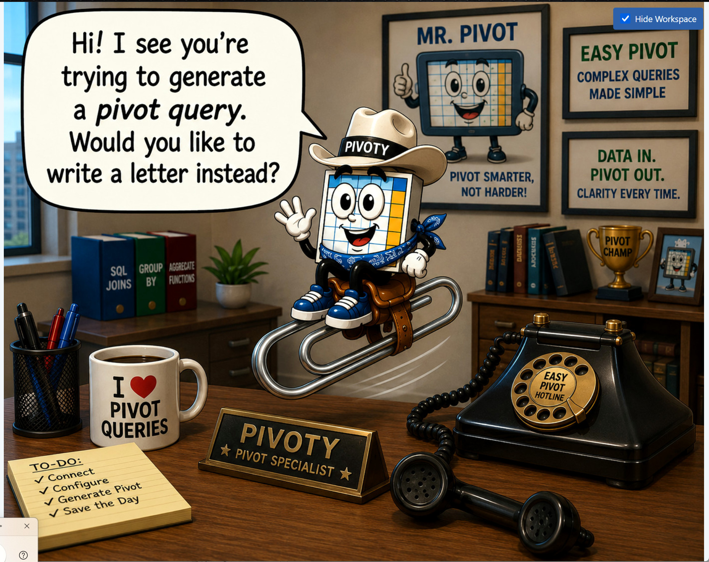

  

  

  

  

  

### If you would like to donate to the Easy Pivot Workbench project, you can donate here:

https://github.com/pivot-my-stuff

I won't nag you for donations. But your support REALLY helps. :) I want you to pivot in
pride with a good graphical interface. Something stylish that only donations can help
bring into existence.

Nah, on second thought, who am I kidding? I would do this just for the fun of it, anyway.
So forget about the donations. I'll take care of it myself. :)

"I see you no longer want donations because you would do this for the fun of it anyway.
Would you like donations instead?" -- Pivoty, valued member of the Easy Pivot support
team.

https://github.com/pivot-my-stuff/easy_pivot/blob/main/img/comics/PIVOTY_EASY_PIVOT_TECH_SUPPORT_HOTLINE.jpg

https://github.com/pivot-my-stuff/easy_pivot/blob/main/img/comics/PIVOTY_HELPS_ANOTHER_CUSTOMER.jpg

### A Note To Database Administrators

Easy Pivot stored procedures perform read-only operations against existing database tables. But, when it is necessary to use a temporary table for pivot code generation, they clean up after themselves and remove them. This happens per user session, avoiding collisions when multiple users are generating pivot query requests at the same time.

The temporary tables involve determining whether a field is numeric or a character string, as this is necessary to handle NULL pivot column information. NULL pivot columns that are numeric must be forced to a zero, and NULL pivot columns that are character strings must be made an empty string.

## Gandalf The White

https://www.youtube.com/watch?v=0lhHDXimoLc

## Welcome To Easy Pivot

Interested in using Easy Pivot rather than just exploring the project?

- **[Easy Pivot Workbench](easy_pivot_workbench/)** — Go directly to the Easy Pivot Workbench, including the application, database implementations, documentation, and supporting files.
- **[Easy Pivot Workbench Installation Guide](easy_pivot_workbench/Easy_Pivot_Workbench_Installation_Guide.md)** — Before getting started, take a quick look at the installation requirements and setup process for the supported databases.

The Workbench is the easiest way to get started with Easy Pivot. The installation guide will help you determine what is required for your particular database environment before you begin.

# Easy Pivot — What It Is and Where We Are

**Easy Pivot is an open-source SQL pivot compiler.** Its purpose is to take a relatively simple JSON description of how a user wants data grouped and pivoted and generate the complete SQL required to produce that pivot. The idea is to eliminate the tedious, database-specific SQL normally required to construct complex dynamic pivots.

Easy Pivot supports four database platforms:

- **Microsoft SQL Server**
- **Oracle**
- **PostgreSQL**
- **MySQL**

Each implementation uses the native capabilities of its database while attempting to provide the same overall pivoting model and user experience.

## What Easy Pivot Can Do

It supports:

- Multiple grouping fields
- Multiple pivot fields
- Aggregate pivots such as `SUM` and `COUNT`
- Boolean/Yes-No style pivots
- Dynamic numbers of pivot columns
- NULL handling appropriate to the data type
- Pivot-column positioning
- Pivot sorting
- Group sorting with `ASC`/`DESC`
- Follows relationships between pivot chips and groups
- Generation of complete SQL source code
- Direct execution of generated pivots
- Deployment as a stored procedure where supported

The important distinction is that **Easy Pivot generates finished SQL**. The resulting pivot query is ordinary static SQL once generated. That makes the generated SQL useful not only for immediate execution, but also for inspection, customization, troubleshooting, documentation, and potentially scheduled jobs.

## Easy Pivot Workbench

The **Easy Pivot Workbench** is the graphical interface we're building around the underlying Easy Pivot engine.

Instead of making users construct the JSON manually, the Workbench lets them visually configure:

- Groups
- Pivot chips
- Aggregate functions
- Boolean pivots
- Follows relationships
- Sorting

It then generates the JSON and asks the appropriate database-specific Easy Pivot implementation to generate the pivot SQL.

And this is the big milestone we've just reached:

> **The Workbench is successfully generating pivot queries for all four supported databases.**

We've also completed substantial cleanup and bug fixing, including fixing the Oracle stored procedure's interaction with the Workbench and strengthening connection testing and diagnostics. At this point only a few small GUI/usability details remain.

Authentication testing has also gone surprisingly well:

- SQL Server — username/password **and Windows Authentication**
- PostgreSQL — username/password **and Windows Authentication**
- Oracle — username/password (Windows authentication is possible if PHP supports it in the future.)
- MySQL — username/password (Windows authentication is possible if PHP supports it in the future.)

## Where We Are Going Next

We're now moving from **"Does it work?"** toward **"Can somebody actually use this comfortably?"**

The immediate work is:

1. Finish the remaining small Workbench GUI cleanup.
2. Continue exercising the graphical interface to find the inevitable weird little things.
3. Cleanly separate the older **manual Easy Pivot implementations** from the Workbench in the repository.
4. Investigate using Easy Pivot from a **SQL Server scheduled job**.

That last one is potentially a pretty significant capability: the Workbench can produce the JSON and data-source definition, Easy Pivot can generate the complete SQL, and a scheduler such as SQL Server Agent could potentially call Easy Pivot, receive that finished SQL, and execute it as part of a recurring job.

And yes, we have already got a pretty good head start on that concept from previous metadata/job-scheduling work.

## Easy Pivot Can Pivot Its Own Pivots Now

To test the robustness of Easy Pivot, we had it create a pivot based on ordinary SQL SELECT code. We then
fed the generated pivot back into Easy Pivot as a new data source. It successfully pivoted its own pivot
code. A useful feature? Maybe. Maybe not. But Easy Pivot can definitely recycle.

For questions or comments, send email to:

tds67 (at) protonmail.com
