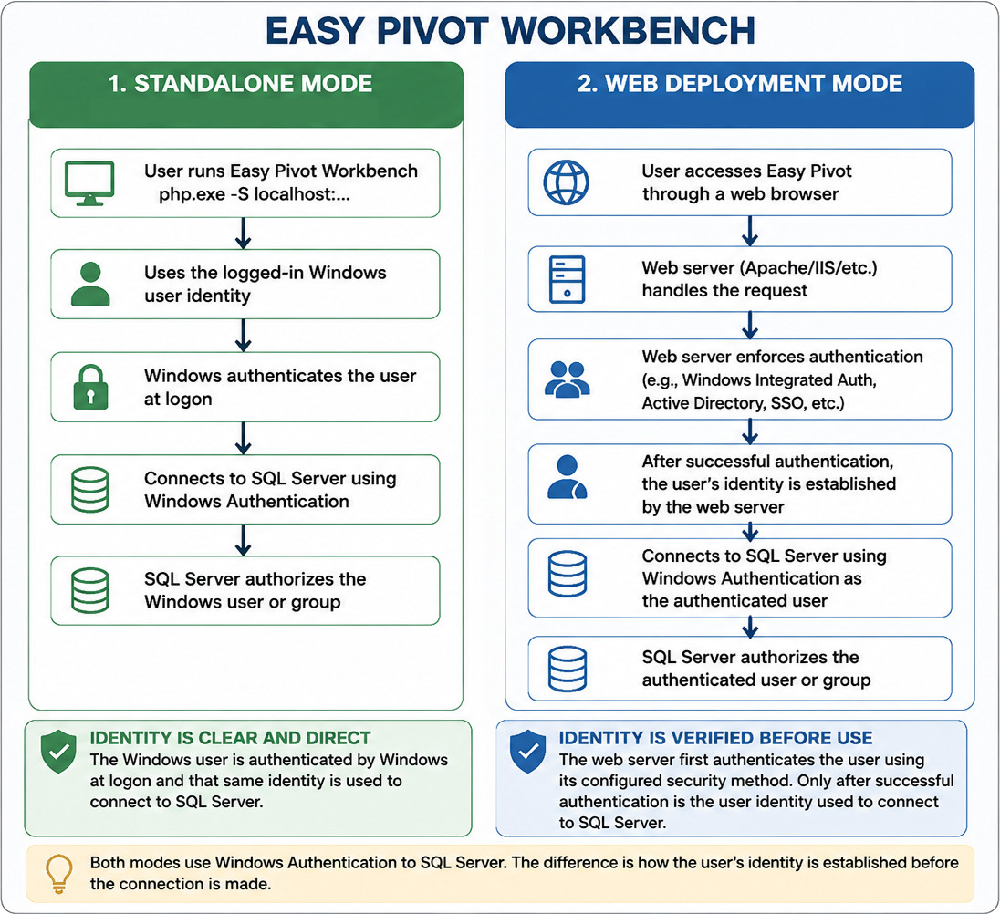

<p align="center">
  
</p>

<p align="center">
  
</p>

<p align="center">
  
</p>

<p align="center">
  
</p>

<p align="center">
  
</p>

<p align="center">
  
</p>

### Easy Pivot The White

I've been sent back. Until my Easy Pivot Workbench task is done.

https://www.youtube.com/watch?v=0lhHDXimoLc

### If you would like to donate to the Easy Pivot Workbench project, you can donate here:

https://github.com/pivot-my-stuff

I won't nag you for donations. But your support REALLY helps. :) I want you to pivot in
pride with a good graphical interface. Something stylish that only donations can help
bring into existence.

Nah, on second thought, who am I kidding? I would do this just for the fun of it, anyway.
So forget about the donations. I'll take care of it myself. :)

"I see you no longer want donations because you would do this for the fun of it anyway.
Would you like donations instead?" -- Pivoty, valued member of the Easy Pivot support
team.

https://github.com/pivot-my-stuff/easy_pivot/blob/main/comics/PIVOTY_EASY_PIVOT_TECH_SUPPORT_HOTLINE.jpg

https://github.com/pivot-my-stuff/easy_pivot/blob/main/comics/PIVOTY_HELPS_ANOTHER_CUSTOMER.jpg

### A Note To Database Administrators

Easy Pivot stored procedures perform read-only operations against existing database tables. But, when it is necessary to use a temporary table for pivot code generation, they clean up after themselves and remove them. This happens per user session, avoiding collisions when multiple users are generating pivot query requests at the same time.

The temporary tables involve determining whether a field is numeric or a character string, as this is necessary to handle NULL pivot column information. NULL pivot columns that are numeric must be forced to a zero, and NULL pivot columns that are character strings must be made an empty string. Except for Oracle. Oracle's philosophy is "empty string = NULL". So we here at the Easy Pivot project can't do much about that. Oracle users will just have to stare at the NULLs from an Easy Pivot and like it. :)

Wrote a comic about it. Want to see it? Here it is:

https://github.com/pivot-my-stuff/easy_pivot/blob/main/oracle/MR_PIVOT_VISITS_THE_ORACLE.jpg

### August 18, 2026 --- Limited Oracle Support

The Easy Pivot Workbench project will support Oracle Database through direct username/password authentication. Windows/External Authentication will not be supported by the project.

We have reached out to Oracle about Windows Authentication and have received no response whatsoever.

We will find out on our own if this is possible, but won't be making it a part of our project.

PostgreSQL testing and other databases will be our focus now.

Oracle sucks. And I worked in an IT environment with Windows Authentication and Oracle. This is REALLY disappointing. The lack of response from Oracle support is inexusable.

### August 17, 2026 --- Current Status

UPDATE: We WILL conduct a controlled laboratory experiment by modifying and compiling the PDO_OCI source ourselves to determine whether the underlying Oracle client authentication mechanism can perform Windows/External Authentication when the PHP-side restriction is removed.

**SQL Server and MySQL testing are complete.** SQL Server supports Windows Authentication through the Workbench. MySQL may also support Windows authentication in certain configurations, but this has not been implemented or tested because that capability requires a paid MySQL edition.

**Oracle testing is nearing completion.** Oracle connectivity through PHP/PDO_OCI is working. However, Windows/External Authentication cannot currently be implemented in the Windows PHP environment because the required external authentication mechanism is not supported by the PHP Oracle interface on Windows. This is a limitation of the PHP/Oracle interface rather than Easy Pivot or the Oracle database itself.

Rather than simply declaring the problem unsolvable, **the Easy Pivot project has reached out to Oracle in good faith for help resolving it.** On August 17, we contacted Christopher Jones and Sharad Chandran Raju, maintainers of PDO_OCI, to explain the problem, describe the Windows enterprise use case, and ask whether there is a supported configuration or a technical reason for the current restriction.

We are not trying to work around Oracle's security model, nor are we trying to harm or circumvent Oracle software. **We are trying to help solve a problem that appears to exist at the PHP/Oracle interface so that Oracle can work cleanly in a Windows-domain PHP environment.** If there is a supported solution, we would much rather use it than modify anything ourselves.

If no supported solution exists, we may conduct a controlled laboratory experiment by modifying and compiling the PDO_OCI source ourselves to determine whether the underlying Oracle client authentication mechanism can perform Windows/External Authentication when the PHP-side restriction is removed. Any such experiment will remain a reproducible source/build exercise rather than a redistributed binary.

**PostgreSQL testing begins next.** Oracle exploration will not hold up the project while we investigate this particular problem. :)

After Oracle and PostgreSQL testing are complete, **Easy Pivot Workbench will support (in one way or another) all four databases: MySQL, Microsoft SQL Server, Oracle, and PostgreSQL.**

### August 16, 2026 --- SQL Server Testing Success & Windows Authentication

Great progress yesterday! The Easy Pivot Workbench SQL Server stored procedure is now working successfully, generating the expected pivot SQL.

We also confirmed how Windows Authentication works with Easy Pivot Workbench.

When running the **standalone Workbench** on a Windows desktop, Easy Pivot uses the logged-in Windows user's domain identity when connecting to SQL Server.

When deployed through a **web server**, authentication is determined by the web server's configuration. The web server administrator can configure the appropriate identity for the organization's security environment.

This gives Easy Pivot two simple deployment paths:

- **Standalone Mode:** Run Easy Pivot directly on your Windows desktop and use your existing Windows/domain identity.
- **Web Deployment Mode:** Host Easy Pivot on a web server and let the organization's administrators configure authentication according to their existing security policies.

The result is simple: **start using Easy Pivot immediately as a standalone application, and move to centralized web deployment when your organization is ready.**

<p align="center">
  
</p>

### August 15, 2026 --- Test Lab Work With SQL Server & Windows Authentication

(Sorry for the project slowing down a bit. We do have full support ready for all four supported databases... but... we are trying to get the Windows authentication correct. We are presently working through issues with that and SQL Server. But we are making steady progress and once we grok that, it's all downhill from there. We win. You win.)

Continued Easy Pivot Workbench SQL Server integration testing. Established Windows Authentication test accounts `EASYPIVOT\squatch` and `EASYPIVOT\admin` on the CRYPTID SQL Server Express instance, with elevated lab privileges for testing. Renamed the SQL Server test database from `baan` to `erp_easy` and verified access to the existing `inventory` test data. Configured SQL Server Express for TCP/IP connections and opened TCP port 1433 through the Windows firewall. Successfully established a remote Windows-authenticated SQL Server connection from IDEARACE to CRYPTID using the `EASYPIVOT\IDEARACE$` machine account. Confirmed that IDEARACE can also connect to CRYPTID using MySQL, establishing that the remote network and Workbench infrastructure are functioning correctly. SQL Server Easy Pivot procedure execution remains unresolved: both the previous and enhanced stored procedure versions eventually time out when called remotely. Current investigation points toward SQL Server metadata/catalog operations, particularly the numeric/string column detection and related metadata queries, as a possible source of the timeout. Further SQL Server stored procedure isolation testing is planned.

### August 14, 2026 --- Test Lab Established

Yesterday we completed the initial Easy Pivot multi-database test lab setup. A second Windows 10 Pro workstation was added to the `easypivot.test` domain, providing a dedicated environment for cross-machine and cross-database testing. The lab infrastructure is now in place and operational, although database configuration and the `ERP_Easy.Inventory` test workload have not yet been installed.

**Test lab components established:**

- Windows 10 Pro domain workstation
- Linux-based Active Directory-compatible domain controller (`DC1`)
- DNS services for the `easypivot.test` domain
- Windows domain authentication and domain membership
- Cross-machine name resolution
- Remote Desktop connectivity by computer name
- SSH connectivity to the domain server
- MySQL
- Oracle Database 26ai Free
- PostgreSQL 18
- SQL Server 2025 Enterprise Developer Edition
- SQL Server Management Studio 22
- FlySpeed SQL Query as the common database connectivity client
- Existing Apache/web and database infrastructure on the primary development workstation
- Network connectivity between the lab systems

**Next phase:** Configure the four database platforms, establish appropriate authentication and permissions, create the common `ERP_Easy.Inventory` simulated ERP test workload, and begin systematic cross-database connectivity and Easy Pivot testing.

### August 13, 2026 --- Easy Pivot Workbench Database Support & Windows Authentication

### Multi-Database Support

Easy Pivot Workbench has been developed to support four database platforms:

- **MySQL**
- **PostgreSQL**
- **Oracle**
- **Microsoft SQL Server**

At this time, **only the MySQL implementation has been officially released and supported**.

Support for PostgreSQL, Oracle, and Microsoft SQL Server has been developed and is currently undergoing testing. Depending on the results of that testing, support for these additional database platforms may be released as early as the next few days. Then it's on to experimenting with Easy Pivot and database job scheduling integration. And then SQLite and MariaDB support.

### Windows Authentication

Easy Pivot Workbench is also being developed to support **Windows authentication across all four database platforms**.

Because meaningful Windows-authentication testing requires an Active Directory environment, a simulated Windows domain environment has been established using **Samba Active Directory Domain Controller (AD/DC) on Linux**. This provides a controlled environment for testing domain authentication, Kerberos, and integrated database connectivity.

**Windows-authentication testing is currently in progress.**

### August 12, 2026 --- Easy Pivot Workbench Installation Instructions

The **Easy Pivot Workbench** provides both standalone and web-based
access to Easy Pivot.

Installation instructions, configuration details, and information about
running the Workbench are available in the documentation included in
the:

`easy_pivot_workbench`

folder.

For MySQL users, the installation documentation includes instructions
for installing the Easy Pivot stored procedure and configuring the
Workbench.

For Oracle, PostgreSQL and SQL Server users: do not feel left out. Your
support is coming soon. We here at the Easy Pivot project are using the
MySQL users as human guinea pigs for development poirposes. But don't
tell them that or they might get mad at us for calling them guinea pigs.
And human. :)

And for SQLite and MariaDB users: we see you out there. Give us time.

### August 11, 2026 --- Remote Database Connections and Connection Diagnostics

Today's testing confirmed that the Easy Pivot Workbench does not have to
run on the same computer as the database server.

A Workbench connection identifies its database target using:

-   Host
-   Port
-   Database
-   User name
-   Password

For example:

``` text
CRYPTID:3306/baan
```

The database name does not have to be `easy_pivot`. The Easy Pivot
stored procedure is installed at the database level, so it can be
installed in an existing application database such as `baan`.

The Workbench can therefore be hosted on one computer and connect to a
database server on another computer, provided the database server,
network, firewall, authentication, and permissions allow the connection.

The **Test Connection** function now reports:

-   Connection success or failure
-   MySQL server version
-   Whether the Easy Pivot stored procedure exists in the selected
    database

This makes it possible to distinguish a database connectivity problem
from a missing Easy Pivot stored procedure.

# Easy Pivot Workbench

**Easy Pivot Workbench is officially no longer vaporware.** 😄 After a
tremendous amount of development and testing, the project has evolved
from a collection of SQL-generation code into a complete, polished
interactive workbench. Users can enter a source query, configure groups
and pivot chips through the interface, generate the resulting pivot SQL,
and execute that SQL against the database. The workbench now includes
dynamic configuration, validation, editing and deletion, NULL handling,
multiple aggregation types, follows relationships, sorting, automatic
source-query parsing, and a redesigned visual interface featuring the
new Pivoty office and chalkboard-style SQL workspace.

The next step is **beta release**. We expect to make Easy Pivot
Workbench available as beta software within the next day or two.
Although the application is already remarkably mature, we want real
users to put it through its paces before calling it production-ready.
**Feedback, bug reports, usability observations, and suggestions are
very welcome.** We've deliberately spent considerable time testing
unusual combinations and trying to break the application ourselves, but
there's nothing quite like having other people approach a tool with
completely different ideas about how it should be used. If you've ever
wished that constructing complicated pivot queries could be easier, we'd
love for you to give Easy Pivot a try and tell us what you think.

## Current Features

-   Visual Group editor
-   Visual Pivot Chip editor
-   Automatic JSON generation
-   Built-in validation
-   Dynamic SQL pivot code generation
-   Local PHP application server (using PHP's built-in development
    server)
-   Direct integration with the Easy Pivot stored procedure

## Current Platform

Easy Pivot Workbench is currently under active development and tested
on:

-   Microsoft Windows
-   PHP 8.x
-   MySQL

## Planned Platforms

Future releases are planned for:

-   Linux
-   macOS

## Future Database Support

Easy Pivot Workbench is being designed as a common graphical interface
for every Easy Pivot implementation. Planned database support includes:

-   SQL Server
-   PostgreSQL
-   Oracle

# Introduction

Easy Pivot is an open-source SQL pivot compiler that dramatically
simplifies the creation of complex dynamic pivot queries.

Rather than manually writing tedious SQL pivot syntax, Easy Pivot
generates the required SQL for you from a simple JSON configuration.

The project was originally developed for Microsoft SQL Server and has
since evolved into a cross-platform solution supporting multiple
database engines while preserving a consistent user experience across
all implementations.

Easy Pivot currently supports:

    * Microsoft SQL Server
    * Oracle Database
    * PostgreSQL
    * MySQL

Choose the folder corresponding to your target database platform:

    sql_server/
    oracle/
    postgresql/
    mysql/

Each implementation contains:

    * Database-specific Easy Pivot source code
    * Installation instructions
    * Documentation
    * Frequently Asked Questions
    * Example configurations

# Easy Pivot in 2026

Easy Pivot was originally published on GitHub in 2021.

Since then, the project has undergone continuous refinement, adding
numerous usability improvements, compatibility fixes, new pivot
capabilities, and support for additional database platforms.

The successful MySQL has also demonstrated that Easy Pivot can be
deployed as a shared stored procedure while maintaining the flexibility
and transparency that have always been central to the project.

The results have been overwhelmingly positive.

Because of that experience, future versions of the SQL Server, Oracle,
and PostgreSQL implementations are expected to receive the same stored
procedure deployment option.

Users will continue to have the choice of either:

-   Executing Easy Pivot directly to produce a finished pivot.
-   Generating SQL source code for inspection, customization, debugging,
    education, or scheduled jobs.

The goal is not to replace either workflow, but to provide the most
convenient experience for every type of user.

# Easy Pivot Workbench and Potential Job Scheduling

The Easy Pivot Workbench is now the browser-based graphical interface for
Easy Pivot. Users can visually configure groups, pivot chips, aggregate
functions, Boolean pivots, follows relationships, and sorting options,
then generate the resulting SQL.

The Workbench can be hosted locally using PHP's built-in development
server or deployed to an existing PHP-enabled web server.

The Workbench can also connect to a database server on another computer,
provided the database server accepts the connection and the required
network, firewall, authentication, and database permissions are available.

The connection identifies the database target using the host, port, and
database fields. The Easy Pivot stored procedure is installed at the
database level, so the target database does not have to be named
`easy_pivot`.

The Workbench's Test Connection function reports database connectivity,
the MySQL server version, and whether the Easy Pivot stored procedure is
present in the selected database.

# Future Directions

One of the guiding principles of Easy Pivot has always been to make SQL
pivoting progressively easier.

The original project eliminated the need to manually write complex pivot
queries.

The next evolution is shared stored procedure deployment, allowing Easy
Pivot to be installed once and reused throughout an organization from a
single maintained code base.

Beyond that, the long-term vision is an Easy Pivot Workbench.

Rather than editing JSON by hand, users would visually select their
grouping fields, pivot fields, aggregate options, and sorting
preferences through a graphical interface while Easy Pivot automatically
generates and executes the required SQL, returning the results in a data
grid. Users may then export the data in the format of their choice. A
reference implementation could be developed using VB.NET or another
freely available application framework.

At present, there appears to be little commercial interest in providing
a database-independent SQL pivot compiler with this level of
flexibility. One possible reason is that SQL pivoting is often viewed as
a collection of database-specific techniques rather than as a
database-independent algorithm capable of being implemented across
multiple platforms.

Easy Pivot is intended to demonstrate that broader approach by providing
an open, database-focused solution for developers, analysts, and
database professionals.

Additional database backends currently under investigation include
SQLite and MariaDB.

# Features

With Easy Pivot, you can:

-   Dynamically pivot fields, resulting in any number of pivoted columns
-   Perform aggregate or Boolean pivots (Yes/No, True/False,
    Present/Absent, or any values you choose)
-   Use any aggregate function supported by the target database platform
-   Automatically remove NULLs that normally result from pivoting
-   Choose any number of fields to pivot on
-   Choose any number of fields to group on while pivoting
-   Position the pivoted columns between grouping fields
-   Reverse the sort order of left-to-right pivoted column names
-   Specify ascending ("ASC") or descending ("DESC") group sorting
-   Deploy Easy Pivot as a shared stored procedure (where supported)
-   Generate SQL source code or execute pivots directly

All the work is done for you, except for a small amount of configuration
required to specify a data source and what field(s) to group and pivot
on.

Beginning with the MySQL implementation, Easy Pivot also supports
installation as a shared stored procedure, greatly simplifying
deployment within production environments.

Future versions of the SQL Server, Oracle, and PostgreSQL
implementations are expected to receive the same deployment option.

For questions or comments, send email to:

tds67 (at) protonmail.com
